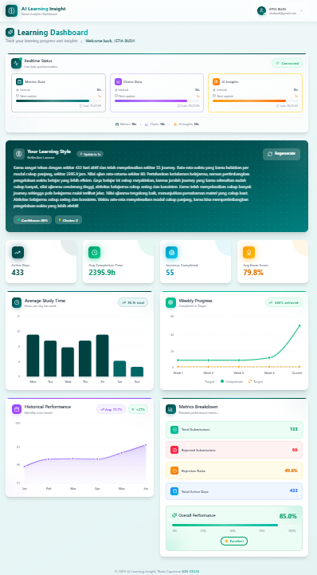

# AI Learning Insight - Prediksi Insight Performa Belajar Menggunakan Machine Learning
---
## Profile
Team ID : A25-CS226

Members
- R007D5Y0207	Andhika Rizky Nur Wahyu
- R007D5Y1928	Valenta Julyan Saputra
- M251D5X0405	Cut Rifa Salsabil
- M251D5X0838	Ilmi Suciani Sinambela
- R269D5Y0113	Ahmad Zuhair Nur Aiman
---
## Roles / Personnel

Machine Learning:
M251D5X0405 – Cut Rifa Salsabil
M251D5X0838 – Ilmi Suciani Sinambela

Backend Development:
R007D5Y0207 – Andhika Rizky Nur Wahyu
R269D5Y0113 – Ahmad Zuhair Nur Aiman

Frontend Development:
R007D5Y1928 – Valenta Julyan Saputra

---
## AI Learning Insight
- Machine Learning: [AI Learning Insight - ML](https://github.com/AI-Learning-Insight-A25-CS226/AI-Learning-Insight/tree/main/ml-service)
- Backend: [AI Learning Insight - BE](https://github.com/AI-Learning-Insight-A25-CS226/AI-Learning-Insight/tree/main/backend)
- Frontend: [AI Learning Insight - FE](https://github.com/AI-Learning-Insight-A25-CS226/AI-Learning-Insight/tree/main/frontend)

## Deskripsi Singkat Proyek
AI Learning Insight adalah platform analisis pembelajaran berbasis Artificial Intelligence (AI) yang membantu mendeteksi gaya belajar siswa berdasarkan data perilaku mereka selama proses belajar. Sistem ini menggunakan Machine Learning untuk menganalisis aktivitas belajar dan menghasilkan insight berupa tipe gaya belajar, tingkat performa, serta rekomendasi peningkatan belajar.

Proyek ini terdiri dari tiga komponen utama:
- Machine Learning Service (FastAPI + Python)
- Backend API (Express + PostgreSQL/Supabase)
- Frontend Dashboard (React + Vite)

Insight yang dihasilkan meliputi:
- Gaya belajar (Fast Learner, Consistent Learner, Reflective Learner, Struggling Learner)
- Confidence Score
- Rekomendasi peningkatan performa
---
## Screenshots


---

## Requirement
Machine Learning

- Python 3.10+
- FastAPI
- Scikit-learn
- Joblib

Backend
- Node.js v18+
- PostgreSQL / Supabase Database
- Express.js

Frontend
- Node.js v18+
- React + Vite

---
## Setup Environment

1. Machine Learning Service (FastAPI)
```
cd ml-service  
pip install -r requirements.txt   
```
2. Backend API (Node.js + Express)
```
cd backend  
npm install  
node scripts/run-sql.js  
node scripts/seed.js  
```
3. Frontend (React + Vite)
```
cd frontend  
npm install  
```
---

## Tautan Model Machine Learning
Model Machine Learning telah tersedia di dalam repository pada folder berikut:

ml-service/models/ 

dan dapat diunduh melalui Google Drive berikut:

[model ML](https://drive.google.com/drive/folders/19ed_3RFmIfos45sMlkQZTNTxaHsECSsX?usp=drive_link)

---

## Dokumentasi API

1. OpenAPI (Swagger)

File: openapi.yaml  
Berisi:
- Endpoint /metrics, /insights, /auth/login
- Struktur request & response
- Authorization: Bearer Token
- Status codes
- Schema prediksi ML

2. Postman Collection

File: AI Learning Insight API (with ML).postman_collection.json  
Fungsi utama:
- Testing endpoint API
- Menyimpan JWT token otomatis
- Debug alur Backend - ML

---
Thank You 🙌


